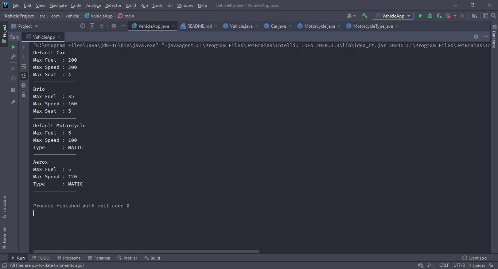

# Tugas Kelompok Minggu 4

### Implementasi Konsep OOP :

- Encapsulation
- Constructor and Overloading Constructor
- Inheritance

### Anggota 

**Nama** | **NPM** 
--- | --- 
Irfan Marzuki | **19111034** 
Wiyanudin | **19111035**
Eko Bambang Nuryanto | **19111036**

### Screnshot Running Program

